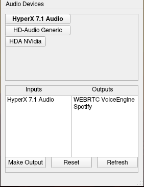
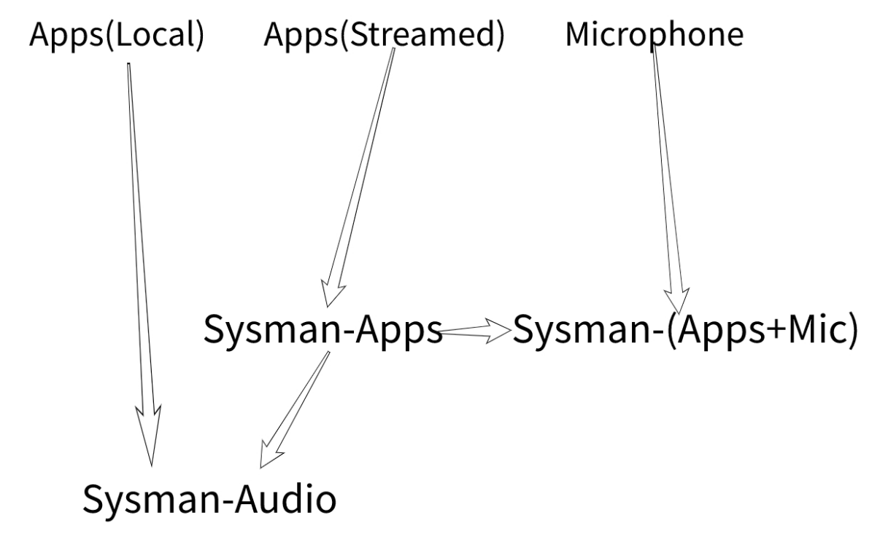

SysMan Layout:  

# Description
## Audio Devices
As can be seen, in the top panel there are the available audio devices that can be switched to by clicking on the device. This sets the device to the default sink.

In the lower frame microphones can be seen in the inputs list view, and application sources in the outputs list view. Multiple elements from each list can be selected by holding shift. The three buttons function as follows:

* Make Output: Takes all selected elements in the list views and creates sinks to stream them in addition to the microphone output
* Reset: Removes all sinks and returns the system back to the state before changed by SysMan
* Refresh: Updates items in the Inputs, Outputs, and the available audio sources.

### Map of Sinks generated

# Build instructions
To build the project:  
`git clone https://github.com/ChrisRuff/SysMan.git`  
`cmake -Bbuild`  
`cd build && make`  
`./SysMan`  
